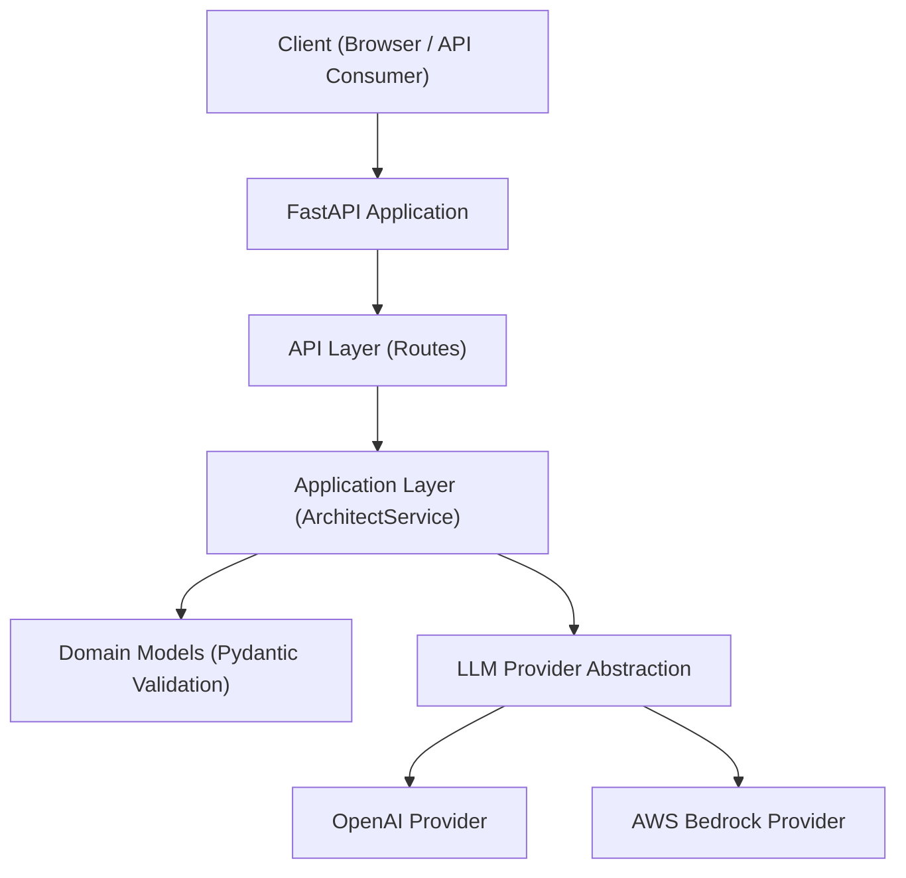

# AI Cloud Architect Copilot

[](https://github.com/sesh14/ai-cloud-architect-copilot/actions)

Production-ready AI backend for generating cloud architectures using pluggable LLM providers.

Built with clean architecture principles, containerized for deployment, and designed to simulate real-world cloud system design workflows.

---

## Overview

AI Cloud Architect Copilot is a modular backend system that:

- Generates production-grade cloud architectures
- Supports multiple LLM providers (OpenAI + AWS Bedrock)
- Enforces structured JSON output validation
- Uses layered architecture for maintainability
- Is fully containerized via Docker
- Is CI-ready for production pipelines

This project demonstrates real-world backend engineering practices applied to AI systems.

---


## System Architecture



## Architecture Principles
- Clean Architecture
- Dependency Inversion
- Provider Abstraction Layer
- Strict Schema Validation (Pydantic v2)
- Async-first design
- Environment-based configuration
- Cloud-native containerization
- CI-ready repository structure Project Structure
app/
 ├── api/
 ├── application/
 ├── core/
 ├── domain/
 ├── infrastructure/llm/
 ├── tests/

Dockerfile
README.md
requirements.txt

Layered responsibilities:
-	API Layer → Request handling
-	Application Layer → Business orchestration
-	Domain Layer → Typed models & validation
-	Infrastructure Layer → LLM provider integrations

## LLM Provider Abstraction
Switch between providers using environment variables.
OpenAI
```
LLM_PROVIDER=openai
OPENAI_API_KEY=your_key
```

 AWS Bedrock
```
LLM_PROVIDER=bedrock
AWS_ACCESS_KEY_ID=
AWS_SECRET_ACCESS_KEY=
AWS_REGION=
```
No code changes required when switching providers.

## Docker Deployment
Build
-	docker build -t ai-cloud-architect-copilot .
Run (OpenAI Example)
```
docker run -p 8000:8000 \
  -e LLM_PROVIDER=openai \
  -e OPENAI_API_KEY=your_key \
  ai-cloud-architect-copilot
```
Run (AWS Bedrock Example)
```
docker run -p 8000:8000 \
  -e LLM_PROVIDER=bedrock \
  -e AWS_ACCESS_KEY_ID=your_key \
  -e AWS_SECRET_ACCESS_KEY=your_secret \
  -e AWS_REGION=us-east-1 \
  ai-cloud-architect-copilot
```
Access API documentation:
```
http://localhost:8000/docs
```

## Example API Request
POST /architect
```
{
  "use_case": "Design a SaaS platform serving 5 million users"
}
```
Response:
```
{
  "services": [...],
  "security": "...",
  "scalability": "...",
  "cost_optimization": "..."
}
```

## CI/CD Pipeline
This repository includes GitHub Actions CI:
-	Python setup
-	Dependency install
-	Lint check
-	Test execution
Workflow file:
-	.github/workflows/ci.yml
Automatically runs on:
-	Push to main
-	Pull requests

## Tech Stack
-	Python 3.12
-	FastAPI
-	Pydantic v2
-	Docker
-	OpenAI SDK
-	AWS Bedrock Runtime
-	GitHub Actions CI
-	Structured Logging

## Engineering Highlights
This project demonstrates:
-	Cloud architecture reasoning via LLMs
-	Pluggable AI provider strategy
-	Clean backend system design
-	Environment-driven configuration
-	Production container workflows
-	CI-integrated repository
-	Structured domain modelling
-	Validation & schema enforcement

